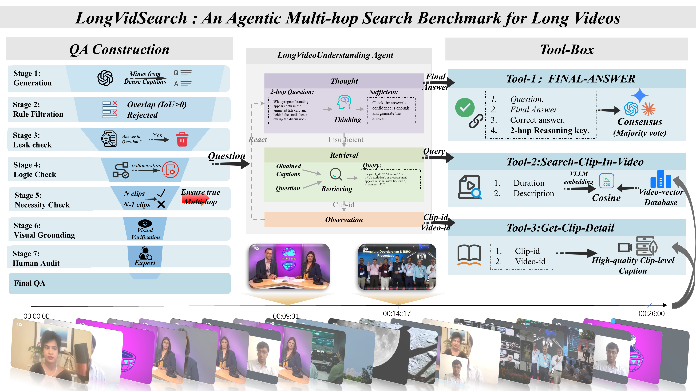

# LongVidSearch: An Agentic Benchmark for Multi-hop Evidence Retrieval Planning in Long Videos

<div align="center">

[](https://arxiv.org/abs/2603.14468)
[](https://github.com/yrywill/LongVidSearch)
[](./LICENSE)
[](https://github.com/yrywill/LongVidSearch)
[](https://github.com/yrywill/LongVidSearch/graphs/contributors)
[](https://github.com/yrywill/LongVidSearch)

</div>


> **LongVidSearch** evaluates **retrieval-necessary** and **evidence-grounded** multi-hop question answering over **long videos** under a **standardized tool interface**, enabling controlled comparison of *agentic retrieval planning* across agents.

---

## 📰 1. News
- **[2026-02-13]** 🎉 We release **LongVidSearch**: **3,000** QA pairs from **447** long videos (~**26 min** avg), stratified into **Hop-2/3/4** with strict retrieval necessity.  
 

---

## 🔍 2. Overview

Long video question answering increasingly relies on **agentic tool use** to retrieve evidence from long videos. However, existing benchmarks rarely **standardize evidence access**, making it difficult to attribute failures to **retrieval planning** vs. **answer generation**.

**LongVidSearch** addresses this gap by:
- enforcing **retrieval necessity** (Hop-2/3/4, where each hop corresponds to a *necessary* evidence clip),
- requiring **evidence-grounded multi-hop reasoning** over long videos,
- providing a **unified tool interface** that fixes evidence access and the retrieval backend,
- reporting both **accuracy** and **tool-call cost** to study the **accuracy–cost trade-off**.

---

## 🖼️ 3. Overview Figures

### Benchmark Framework
<p align="center">
  
</p>
<p align="center">
  <em>Figure 1: Overview of LongVidSearch. Agents iteratively retrieve clips, read captions via standardized tools, and are evaluated by a three-judge majority vote protocol.</em>
</p>

### Dataset Statistics 
> **Note:** This table mirrors the paper’s dataset statistics.

| Task Category | 2-Hop | 3-Hop | 4-Hop | Total (Ratio) |
|---|---:|---:|---:|---:|
| Causal Inference | 436 | 282 | 144 | **862** (28.7%) |
| Global Summary | 512 | 181 | 166 | **859** (28.6%) |
| Visual Tracking | 653 | 136 | 61 | **850** (28.3%) |
| State Mutation | 238 | 119 | 72 | **429** (14.3%) |
| **Overall Count** | **1,839** | **718** | **443** | **3,000** |
| *Overall Percentage* | *61.3%* | *23.9%* | *14.8%* | *100.0%* |
---

## ⭐ 4. Key Features

- **Retrieval-necessary multi-hop QA**: Hop-\(k\) questions require **\(k\) necessary evidence clips** (removing any one makes the question underdetermined).
- **Standardized tool interface**: identical evidence access for all agents to isolate **query formulation** and **multi-step evidence acquisition** capability.
- **Stable evaluation**: majority vote of **three strong LLM judges** (e.g., GPT-5 / Gemini 3 Pro / GPT-4o) with expert audit for consistency checking.
- **Efficiency-aware**: reports **tool-call cost** as a direct measure of evidence-access overhead.

---

## 🗂️ 5. Dataset

- **3,000 QA pairs** from **447 long-form videos**
- Average video duration: **~26 minutes**
- Four capability categories:
  - **State Mutation (Entity + Transition)**: detect **critical transition points** and contrast pre/post states.
  - **Visual Tracking (Entity + Aggregation)**: aggregate appearances for **long-term ReID** across gaps/occlusions/view changes.
  - **Causal Inference (Narrative + Transition)**: establish a **semantic bridge** between cause and effect events.
  - **Global Summary (Narrative + Aggregation)**: synthesize a **holistic conclusion** from dispersed narrative evidence.


---

## 🧰 6. Standardized Tools

All agents interact with LongVidSearch through the same tools:

- `Search_Clips_In_Video(video_id, query, top_k)`  
  Retrieves top-\(K\) relevant clips for a textual query within a given video.

- `Get_Clip_Detail(clip_id)`  
  Returns a high-quality caption for the queried clip (used as evidence).

- `FINAL_ANSWER(answer_text, evidence_clip_ids)`  
  Submits the answer and the list of viewed evidence clip IDs; evaluation computes accuracy and aggregates tool-call cost from logs.

This fixed interface ensures performance differences primarily reflect **agentic retrieval planning**, not retriever strength or privileged evidence access.

---

## 🤖 7. Baseline Agent

We provide a VideoAgent-style baseline that follows an iterative **plan → retrieve → read → reason** loop:
1. generate a textual query based on current hypothesis and partial evidence,
2. retrieve candidate clips via `Search_Clips_In_Video`,
3. read captions via `Get_Clip_Detail`,
4. decide whether additional retrieval is needed,
5. output `FINAL_ANSWER` with selected evidence clip IDs.


---

## 📏 8. Evaluation

### Metrics
- **Answer Accuracy**  
  Exact match where applicable; otherwise **LLM-as-a-judge** with a strict rubric and **three-judge majority vote**.

- **Tool-call Cost**  
  Number of standardized tool invocations per question, measuring evidence-access overhead.

### Oracle (Golden Clips)
We also include an oracle-style setting where the agent is given **golden evidence clips**. Near-perfect oracle accuracy indicates that the main bottleneck in the standard setting is **retrieval and retrieval planning**, rather than reasoning with correct evidence.

---

## 📌 9. Quick Start

Please use the following commands for environment setup and installation 👇

### 9.1 Installation
```bash
git clone https://github.com/yrywill/LongVidSearch.git
cd LongVidSearch
pip install -r requirements.txt
```
### 9.2 Run Baseline Agent
TODO: replace with your actual api key and url in tool.py
```bash
bash ./example/baseline-example.sh
```

## 🧱 10. Repository Structure
```text
LongVidSearch/
├── data_generation/          # agentic construction pipeline (generation + filtering)
├── dataset/                  # dataset packaging  / splits 
├── example/
│   └── baseline-example.sh   # runnable baseline example
├── figs/                     # figures for paper/README
├── video_embeddings/         # retrieval embeddings
├── cache_llm.pkl             # optional cache
├── full-QA(3000).json              # benchmark QA file
├── video-caption.parquet     # high-quality captions for video clips
├── main.py                   # baseline entry (main)
├── tools.py                  # standardized tool interface 
├── utils_general.py          # shared utilities
├── requirements.txt
├── LICENSE
└── README.md
```

## 📚 11. Citation
```bibtex
@inproceedings{longvidsearch2026,
  title     = {LongVidSearch: An Agentic Benchmark for Multi-hop Evidence Retrieval Planning in Long Videos},
  author    = {Rongyi Yu ,Chenyuan Duan ,Hao Liang ,Ruichuan An ,Wentao Zhang},
  booktitle = {SIGIR Submitted},
  year      = {2026}
}
```

## 📬 12. Contact

For questions or feedback, please open an issue in this repository.
